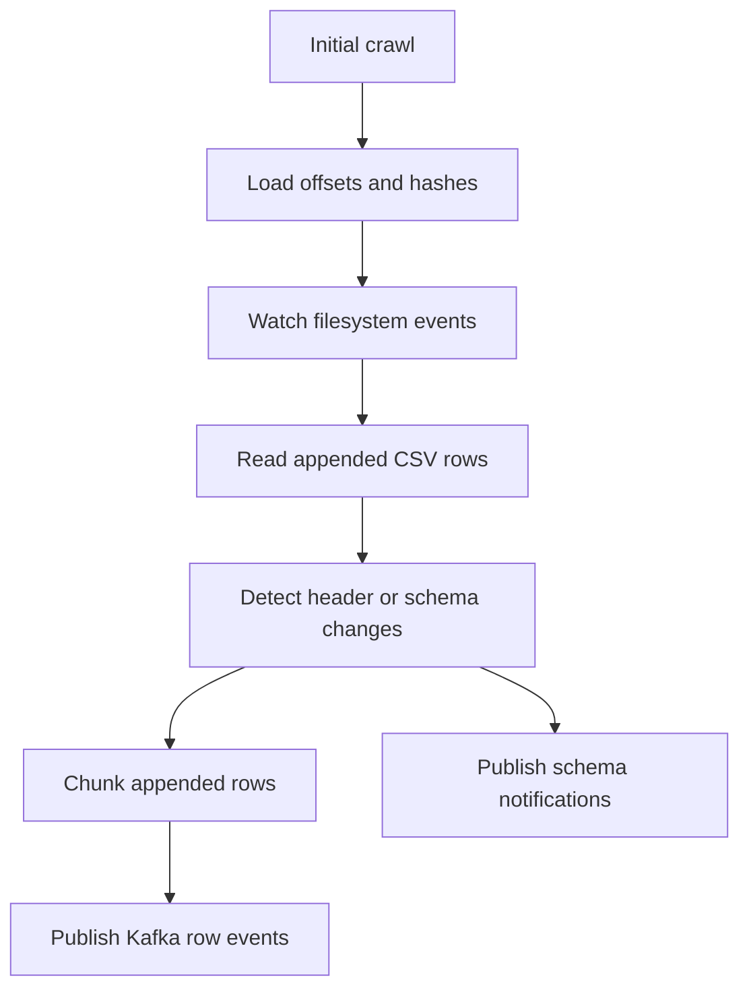
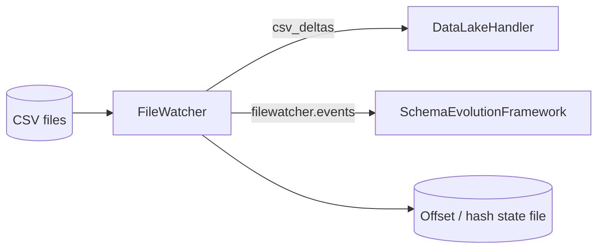

# FileWatcher

FileWatcher monitors a directory of CSV files, emits schema notifications, and publishes appended row deltas to Kafka. It is the ingestion edge of the automated schema-evolution stack.

## Responsibilities

- Perform an initial crawl of the watched directory.
- Persist file offsets and hashes in local state.
- Detect file create and modify events.
- Emit append-only row deltas to Kafka.
- Emit schema notifications when source file headers change.

## Architecture

### Mermaid processing flow




The refactor keeps filesystem and watchdog effects at the edge.

- `domain/` contains file-event classification and offset calculations.
- `monitor/` contains the watchdog shell and bootstrap crawl.
- `helper/` contains filesystem and concurrency adapters.
- `utils/` contains hashing, Kafka publishing, and state persistence.
- `docs/` contains architecture and function-level documentation.

## Runtime interfaces

### Inputs
- local or mounted CSV files in the watched directory
- watchdog filesystem events

### Outputs
- Kafka topic: `csv_deltas`
- Kafka topic: `filewatcher.events`
- persisted state file containing offsets and hashes

## Configuration

The repo-local `.env` file is the main runtime configuration source.

Key groups in `.env`:

### File watching
- `DATA_DIRECTORY`
- `HOST_DATA_DIRECTORY`
- `STATE_FILE`
- `WATCHDOG_OBSERVER`
- `WATCHDOG_POLL_INTERVAL_SEC`

### Kafka and chunking
- `KAFKA_BROKER`
- `KAFKA_TOPIC`
- `CHUNK_SIZE_ROWS`
- `MAX_CHUNK_BYTES`

### Schema-notification publishing
- `SEF_SCHEMA_TOPIC`
- `SEF_SOURCE_SYSTEM`
- `SEF_DOMAIN`

## Data flow

### Mermaid data-flow diagram




1. FileWatcher performs an initial crawl and records baseline offsets and file hashes.
2. A CSV create or modify event is detected.
3. The service computes new appended rows since the prior offset.
4. File header changes are published to `filewatcher.events`.
5. Appended rows are chunked and published to `csv_deltas`.
6. DataLakeHandler consumes row deltas and SchemaEvolutionFramework consumes schema notifications.

## Operations

### Local run
```bash
pip install -r requirements.txt
python main.py
```

### Docker Compose
```bash
docker compose up --build
```

## Licensing model

This repository is licensed under the Apache License, Version 2.0. You may use and modify the source under the terms in `LICENSE`. Watched source data, generated state files, and emitted event payloads remain deployment data and are not covered by any separate documentation license grant.
